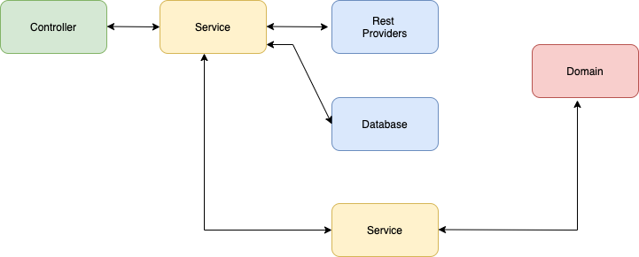

# bookstore_users-api

Users API Service

## Overview

This application handles users.

## Project Structure

This project was written in golang, designed to use MVC architecture and DAO pattern to abstract data persistence.

## Endpoints

- `GET  /user/:user_id` : Returns the user data.
  
- `POST /users` : Saves a new user. 
  
- `PUT  /user/:user_id` : Updates a user.
  
- `PATCH /user/:user_id` : Updates some user data. 
  
- `DELETE /user/:user_id`: Deletes a user.

